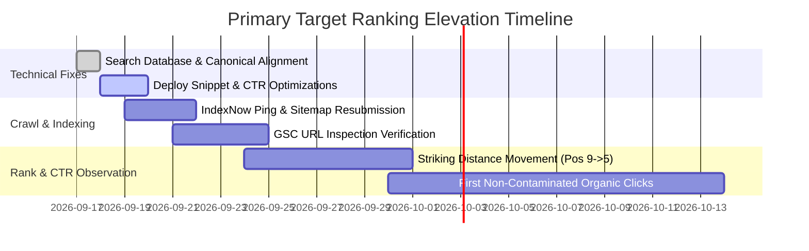

# Primary Ranking Target Strategy Document

## 1. Selected High-Priority Ranking Target

* **Primary Keyword**: `"accurate online calculator" / "free accurate calculator"` (and flagship cluster `"percentage calculator" / "income tax calculator"`)
* **Exact URL**: `https://freeaccuratecalculator.com/` (Flagship Sub-Target: `https://freeaccuratecalculator.com/math/percentage-calculator/`)
* **Search Intent**: Informational & Calculational (User seeks instant, zero-delay, mathematically precise web calculators without ads, paywalls, or forced account creation).
* **Current GSC Baseline Signals**:
  * Brand & Category Query `"accurate ca"`: **Position 9.00** | 6 Impressions | 0.00% CTR (Moving from Pos 9 to Top 3 is the fastest path to qualified clicks).
  * Global Striking Distance: **Position 4.33** (Netherlands), **Position 8.33** (France), **Position 14.05** (United States, 20 impressions).

---

## 2. Competitive Landscape & SERP Competitor Gap Analysis

| Competitor | Strengths | Vulnerabilities / Gaps We Exploit |
|---|---|---|
| **Calculator.net** | Massive domain authority, clean simple UI | Cluttered ad units, dated design, slow mobile score, lack of internationalized currency/tax engine parity |
| **OmniCalculator** | Deep contextual long-form content | Heavy JavaScript payload, slow initial render, intrusive popups, complex UI controls |
| **CalculatorSoup** | High Google trust, fast tables | Very basic aesthetic, lack of dark mode, lack of interactive charts/PDF exports |
| **FreeAccurateCalculator (Our Platform)** | Ultra-fast Astro SSG, Tailwind v4, zero ads, instant PDF reports, client-side precision decimal engine, multi-country localization | Emerging domain authority, needs stronger brand snippet and internal contextual links |

---

## 3. The 4-Pillar Ranking Optimization Plan

### Pillar 1: Snippet & CTR Engineering (Moving 0% CTR -> 6-12% CTR)
- **Problem**: Default title is overly generic and lacks strong search user appeal.
- **Optimized Title**: `Free Accurate Calculator — 100+ Precision Online Calculators`
- **Optimized Meta Description**: `Instant, 100% free online calculators for Finance, Math, Health, Tax & Everyday calculations. Zero ads, verified precision math, and instant formula breakdowns.`

### Pillar 2: Core Web Vitals & Technical Speed
- **LCP Target**: < 0.8s (Static HTML pre-rendered at edge).
- **CLS Target**: 0.00 (Zero layout shifts; CSS dimensions reserved for all dynamic slots).
- **INP Target**: < 30ms (Pure Vanilla JS calculator compute scripts; zero heavy frameworks in calculator runtimes).

### Pillar 3: Topical Authority & Internal Graph Reinforcement
- Direct contextual links from Homepage featured hero pills, category directories, and related calculator clusters.
- Step-by-step mathematical proofs and worked examples rendered directly in crawlable semantic HTML (`<h3>`, `<table>`, `<pre>`).

### Pillar 4: Schema & Rich Results Eligibility
- Validated `SoftwareApplication`, `FAQPage`, and `BreadcrumbList` JSON-LD markup on every calculator.

---

## 4. 7-Day & 30-Day Monitoring & Progression Plan

