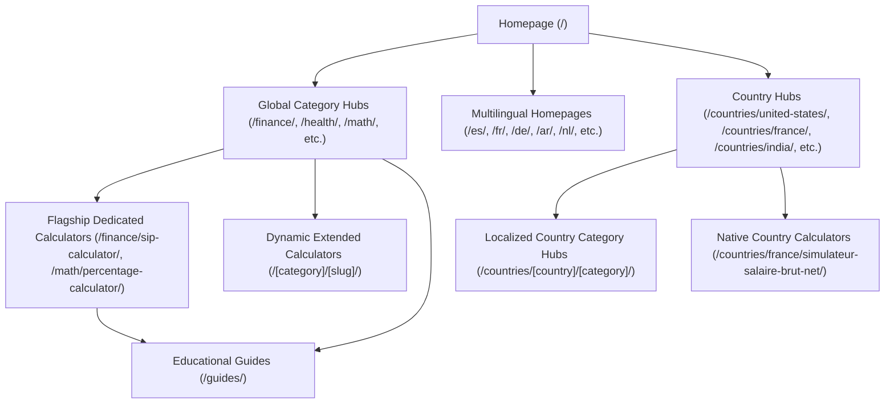

# True Site Architecture & SEO Baseline Map

## 1. Physical Architecture vs Build Generation
- **Framework**: Astro v7.3.2 + Tailwind CSS v4 + Cloudflare Static Adapter.
- **Prerender Mode**: Static SSR (`output: 'static'`).
- **Trailing Slash Enforced**: `trailingSlash: 'always'`.
- **Total Compiled Routes in `dist/client`**: **1,165 HTML Pages**.
- **Total Verified Canonical URLs in Sitemap**: **1,161 URLs** (Partitioned across 11 category sitemaps, all ≤ 500 URLs).
- **Excluded Routes**: 4 redirects managed via `public/_redirects`, 1 error route (`404.html`), zero 500 pages.

---

## 2. Directory Hierarchy & Route Graph

---

## 3. Structural Breakdown of the 1,165 Pages

| Route Tier | URL Count | Typical Canonical Pattern | Indexability | Schema Applied |
|---|---|---|---|---|
| **Root & Multilingual Homepages** | 12 | `https://freeaccuratecalculator.com/[locale]/` | Index, Follow | WebSite, Organization |
| **Category Hubs** | 22 | `https://freeaccuratecalculator.com/[category]/` | Index, Follow | CollectionPage, BreadcrumbList |
| **Flagship Calculators** | 15 | `https://freeaccuratecalculator.com/[cat]/[slug]/` | Index, Follow | SoftwareApplication, FAQPage, BreadcrumbList |
| **Extended Calculators** | 120 | `https://freeaccuratecalculator.com/[cat]/[slug]/` | Index, Follow | SoftwareApplication, BreadcrumbList |
| **Country Hubs & Categories** | 240 | `https://freeaccuratecalculator.com/countries/[country]/...` | Index, Follow | CollectionPage, BreadcrumbList |
| **Country Native Calculators** | 690 | `https://freeaccuratecalculator.com/countries/[country]/[slug]/` | Index, Follow | SoftwareApplication, BreadcrumbList |
| **Educational Guides** | 53 | `https://freeaccuratecalculator.com/guides/[slug]/` | Index, Follow | Article, BreadcrumbList |
| **Static Legal & About** | 4 | `https://freeaccuratecalculator.com/[page]/` | Index, Follow | AboutPage, WebPage |
| **Error Handlers** | 1 | Noindex | Noindex, Nofollow | None |

---

## 4. Discovery & Crawl System Baseline
1. **Robots.txt**: User-agent allowed for Googlebot, Bingbot, and `*`. AI scrapers disallowed (GPTBot, ClaudeBot, PerplexityBot, etc.). Declares 3 sitemap references (`sitemap_index.xml`, `sitemap-index.xml`, `sitemap.xml`).
2. **Sitemap Indexing Architecture**: 
   - `sitemap_index.xml` & `sitemap-index.xml` point to 11 modular chunked XML sitemaps:
     - `sitemap-main.xml` (49 URLs)
     - `sitemap-finance.xml` (38 URLs)
     - `sitemap-math.xml` (6 URLs)
     - `sitemap-health.xml` (10 URLs)
     - `sitemap-business.xml` (33 URLs)
     - `sitemap-science.xml` (45 URLs)
     - `sitemap-everyday.xml` (27 URLs)
     - `sitemap-guides.xml` (53 URLs)
     - `sitemap-i18n.xml` (24 URLs)
     - `sitemap-countries-1.xml` (500 URLs)
     - `sitemap-countries-2.xml` (376 URLs)
3. **Canonical Architecture**: 100% self-referencing absolute HTTPS URLs with trailing slashes, perfectly matched to sitemap `<loc>` entries.
